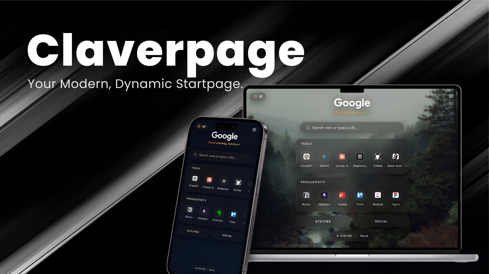

  

  <h1>Claverpage</h1>
  
<strong>Your modern, dynamic browser startpage.</strong>

   

  

    

  

    
    
    
  

---

Claverpage is a browser homepage built for speed, aesthetics, and personal control. No frameworks, no bloat — pure HTML, CSS, and JavaScript. It loads instantly, keeps your shortcuts in sync across devices, and adapts its look to the time of day and weather outside.

---

### Features

**Dynamic Environment**
The background gradient shifts through the full day cycle — pre-dawn, sunrise, golden hour, dusk, night — and adjusts its tone based on live weather (clear, cloudy, rain, snow, storm). Updates every minute.

**Weather Widget**
Live weather auto-detected from your location. Tap to see temperature, humidity, high/low, and rain chance. Manually set any city from the widget.

**Custom Wallpaper**
Paste any image URL into the background editor. Control blur, dim, and zoom, then drag to reposition. Cached locally so it loads offline too.

**Cloud Sync**
Every user gets a unique Claver ID on first load. Shortcuts sync automatically and follow you to any device. Change your ID in Settings to link to an existing device.

**Search**
Switch between Google, Bing, DuckDuckGo, Brave, and Startpage in one tap. Live suggestions as you type. Search bangs — `!yt`, `!gh`, `!r`, `!w`, `!a` and more — for instant targeted search. Press `/` anywhere to focus the search bar.

**Shortcuts**
Four categories — Tools, Productivity, Utilities, Social. Add, remove, and drag-to-reorder from within the modal. Elastic scroll on mobile.

**Settings**
Dark and light theme, performance mode, display name, wallpaper editor, and sync ID — all in one panel.

---

### Getting Started

1. Click **[Open Claverpage](https://claverpage.netlify.app/)** above
2. In your browser settings, set that URL as your homepage and new tab page

---

### Built With

---

### Licensing & Usage

Released under a custom license.

✔️ You are welcome to use the live link as your personal homepage, view the source for learning, or fork the repo for private experimentation.

❌ You are not permitted to redistribute, republish, or create derivative works from this code for public release without explicit written permission.

See [LICENSE](LICENSE) for full terms.

---

### Contact

Siddhant Digraje — [siddhantdigraje77@gmail.com](mailto:siddhantdigraje77@gmail.com)

---

Made with ❤️ by Siddhant

