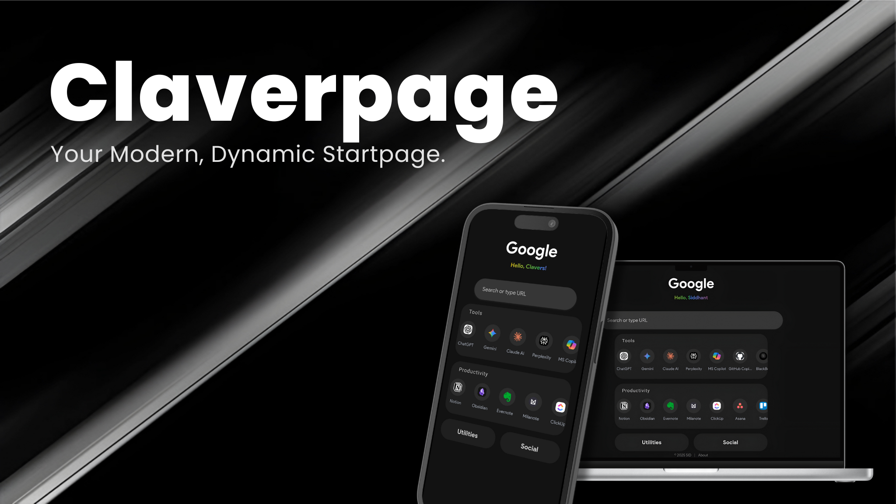

  
  <h1>Claverpage</h1>
  

    <strong>Transform your browser's new tab page into a sleek, fast, and personal command center.</strong>
  

  
  

    
    
    
  

---

### 🌟 Overview

Claverpage is a modern, productivity-focused browser homepage designed for those who value speed, aesthetics, and simplicity. Built with pure vanilla HTML, CSS, and JavaScript, it offers a beautiful, bloat-free experience that loads instantly and helps you get where you're going, faster.

### ✨ A Glimpse into Claverpage

| Dynamic Search & Suggestions                                       | Organized Shortcut Modals                                            |
| ------------------------------------------------------------------ | -------------------------------------------------------------------- |
|  |      |

### 🚀 Core Features

*   **Fly-by Search Engine Switching:** Instantly cycle between Google, Bing, DuckDuckGo, and more directly from the homepage.
*   **Live Search Suggestions:** Get intelligent, real-time search suggestions as you type to speed up your queries.
*   **Elegant & Fluid Interface:** A meticulously crafted dark-mode UI with smooth, purposeful animations that enhance the user experience.
*   **Smart Shortcut Organization:** Access your most-used links in horizontally-scrolling blocks and view larger collections in clean, full-screen modals.
*   **Zero-Dependency Performance:** Built without any frameworks or libraries for maximum speed and near-instant load times.
*   **Fully Responsive:** Looks and works beautifully across all devices, from mobile phones to desktops.

---

### 🖥️ Live Demos: Choose Your Experience

Claverpage is available in several versions to fit your needs. The **Main Experience** is the definitive version recommended for most users.

| Version               | Description                                                                                             | Live Link                                                                    |
| --------------------- | ------------------------------------------------------------------------------------------------------- | ---------------------------------------------------------------------------- |
| 🚀 **Main Experience**    | The complete version with all features, branding, and animations. **This is the recommended version.**      | **[Open `index.html`](https://claverpage.netlify.app/)**          |
| 🏢 **Claver Edition**     | Identical to the Main Experience, but with the "Siddhant" branding replaced by the neutral "Claver".  | **[Open `claver.html`](https://siddhantdg.github.io/Claverpage/claver)** |
| ⚡ **Lite Version**        | A lightweight build with some blur effects disabled for maximum performance on older devices.      | **[Open `lite.html`](https://claverpage.netlify.app/lite)**      |
| 🖥️ **Wide-Screen Mode** | A compatibility version designed for unusual screen ratios (e.g., TVs or ultra-wide monitors).       | **[Open `wide.html`](https://claverpage.netlify.app/wide)**      |

---

### 🏁 Getting Started

To begin using Claverpage:

1.  **Choose a Version:** Click on your preferred **Live Link** from the table above.
2.  **Set as Homepage:** Open your browser's settings and set the chosen URL as your default homepage and/or new tab page.

That's it! Your new, productive homepage is ready.

### 💻 Built With

This project is built with a focus on simplicity and performance, using only the core technologies of the web:

*   
*   
*   

---

### 📜 A Note on Licensing & Usage

As the first project I've built and shared publicly, Claverpage is very special to me. For this reason, it is released under a **Custom License** that I ask you to respect.

*   ✔️ **You are welcome to:**
    *   View and inspect the source code for learning and educational purposes.
    *   Fork the repository for personal, private experimentation.
    *   Use any of the live GitHub Pages links as your personal browser homepage.

*   ❌ **You are strictly not permitted to:**
    *   Create derivative works from this code for public redistribution.
    *   Redistribute or republish this code, in part or in whole, under your own name without my explicit written permission.

### 📞 Contact

Siddhant Digraje - [siddhantdigraje77@gmail.com](mailto:siddhantdigraje77@gmail.com)

Project Link: [https://github.com/siddhantdg/Claverpage](https://github.com/siddhantdg/Claverpage)

---

Made with ❤️ by Siddhant :)

